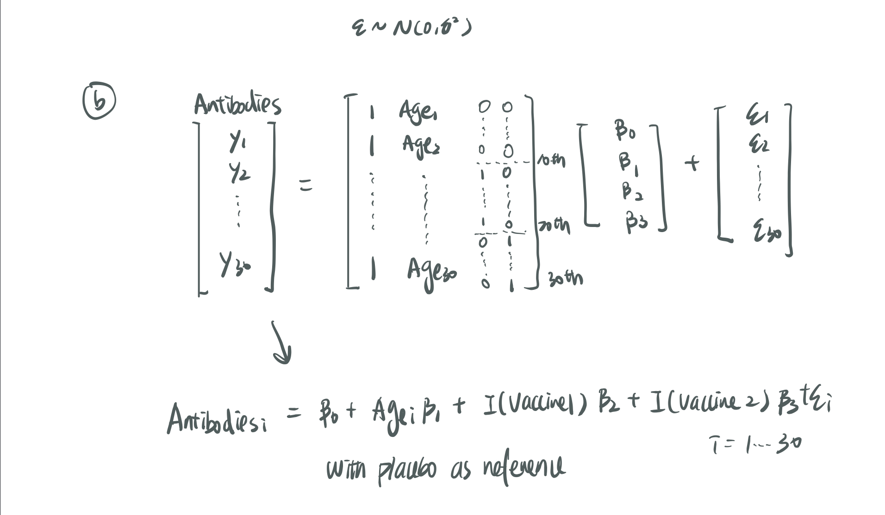

### Problem 1

#### (a)

- **Outcome**: 
  + Antibodies : level of antibodies at 6-month
- **Predictor**: 
  + age : age (years) of patients at baseline
  + Vaccine 1
  + Vaccine 2
  + Placebo

- **equation of the linear regression model**
  + `Antibodies(i) = beta0 + beta1*age(i) + beta2*I(Trt=Vaccine1)(i) + beta3*(Trt=Vaccine2)(i)+error(i)`
  + i=1,2,...,30
  + With placebo as reference category
  
- **distribution assumption imposed on the error terms**
  + Error terms should be uncorrelated and follow a normal distribution with mean = 0 and a constant variance. N(0,var)

#### (b)




### Problem 2

#### (a)

$$salaries(hat) = 17.847 + 1.103*Years(hat) + 0.322*Publications(hat) + 1.593*Gender(hat) + 1.289*Grants(hat)$$

#### (b)
$$slopeGender +(-) t(30,0.975)*se(Gender)$$
```{r}
qt(0.975,30)
gender_upper=1.593+(qt(0.975,30)*0.688)
gender_lower=1.593-(qt(0.975,30)*0.688)
```
- 95% CI for the coefficient associated with ‘Gender’ is (`r gender_lower`,`r gender_upper`)

#### (c)

**Hypothesis**

  - H0:There is no linear association exists between publication and faculty salaries (in thousands of dollars).beta_publication=0

  - H1:There is  linear association exists between publication and faculty salaries (in thousands of dollars).beta_publication!=0


**Calculations**

$$ (beta_publication-0)/se(publication) = 0.322/0.521 = `r 0.322/0.521` $$


**Decision**

```{r}
qt(0.975,30)
```

  - **Critical Value**: t~(30,0.975) = 2.042272
  - **Decision Rule**:
    + Reject H0: if |t| > t(30,0.975)
    + Fail to reject H0:|t| < t(30,0.975)

**Conclusion**

  - For the current data, we have test stats of 0.6180422	for slope. Since t_stats:0.6180422 < critical value 2.042272, we fail to reject the null and conlcude that there is no significant linear association exists between publication and faculty salaries (in thousands of dollars).
  
**comment**
- Now we know that there is no significant linear association exists between publication and faculty salaries, we can conclude that the the most significant variables in predicting salary is the success in obtaining grant support.

#### (d)
- We could not generalize our findings to the entire academic community (i.e., US) because even though we yield some significance result from our current data, all of out samples are drawn from the MSPH faculty which might not represent all faculty in the united states. Differences between department and location might make our current conclusion not applicable.


### Problem 3

Among the three model, I would recommend model B.

- Mallow's Cp Criteria: Cp compares the predictive ability for each model to the full modes, we want to choose Cp values that is <= number of parameter. From the three models, Model A's Cp value is larger than the number of parameter. Model B and C both have Cp smaller than the number of parameter, but model B have Cp value that are closer to the number of parameter. Also Model B have smaller number of parameter but similar Cp, which meet the goal of model selection: "get a small number of variables while maintaining the same predictive ability"

- Adjusted R-squared: Adjusted R^2 tell us how well the variance of outcome is explained by the relationship with predictors. Therefore, we will want to have models that have larger adjusted R-squared value. Overall, Model B have the largest adjusted R-squared value.

- MSE: 
  - We first compare the MSE between models and see that all three models have similar MSE. Model B and Model C have smaller MSE than Model1.
  - We then compare MSE on Testing and Training data within each model. Which I calculate the difference between MSE and MSPE within each model. the difference between MSE and MSPE is also smallest in Model B comparing to other models.

```{r}
0.078-0.045
0.072-0.043
0.079-0.042
```

- Therefore, overall, I would recommend model B.

### Problem 4

#### (a)
```{r}

#Import Data 
hospital_df=
   read.csv("./data/Hospital.csv") 
```

##### fit regression model
fit a simple linear regression with length of stay (LOS) as the outcomes and number of beds (BEDS) as only predictor. Use R to address the following points:

Length of stay(i) = beta0 + beta1*Number of beds(i) + error(i)
```{r}
  linear = lm(LOS ~ BEDS, data=hospital_df)
```


###### summary
```{r}
summary(linear)
```

###### 95% CI for the true slope
$$slope +(-) t(111,0.975)*se(beta)$$
```{r}
confint(linear,level=0.95)
```
- 95% CI for the true slope is (0.002355649,0.005757623)

#### (b)


```{r}
library(infer)
boot_dist <- hospital_df %>%
specify(formula = LOS ~ BEDS) %>%
generate(reps = 1000, type = "bootstrap") %>%
calculate(stat = "slope")
# Save the estimated slope values (1,000)
boot_dist_slope <- boot_dist[[2]]
```

#### (c)
```{r}
library(ggplot2)
 boot_dist%>% 
  ggplot(aes(x = stat)) + geom_histogram(fill="darkorange3")+labs(
    titles = "histogram of the distribution of estimated slopes",
    x = "estimated slopes",
    y = "frequency"
  )
```

Comment: In order to make inferences, the sampling distribution of slope should follow normal distribution. From the histogram we see that the estimated slope roughly follow a normal distribution, thus we conclude that after bootstrap, the distribuiton of slope does approximate the shape of the sampling distribution of beta1 which meet the assumption of normal distribution for parameters.

#### (d)

```{r}
lower=quantile(boot_dist_slope,0.025)
upper=quantile(boot_dist_slope,0.975)
```

- The 95% CI for the true slope is (`r lower`,`r upper`)

#### (e)
- Before Bootstrap:95% CI for the true slope is (0.002355649,0.005757623)
- After bootstrap:The 95% CI for the true slope is (`r lower`,`r upper`)

Overall, both confidence interval have similar value, meaning the original data does represent the underlying distribution. To be exact, the 95% CI for the true slope after bootstrap has wider interval comparing to the 95% CI before bootstrap.

